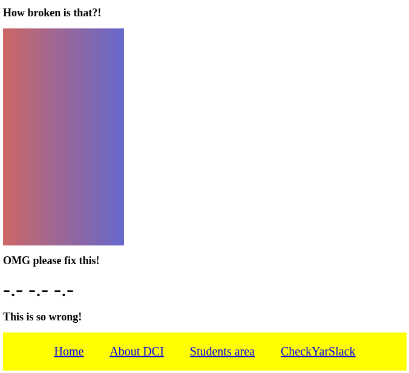

# Basic CSS Exercises

## Exercise: CSS Display Property

**Instructions**:
1. Create a stylesheet `solution.css` and link it to the `index.html` file.
2. Add styling in order to make the page resemble the mockup image below.

